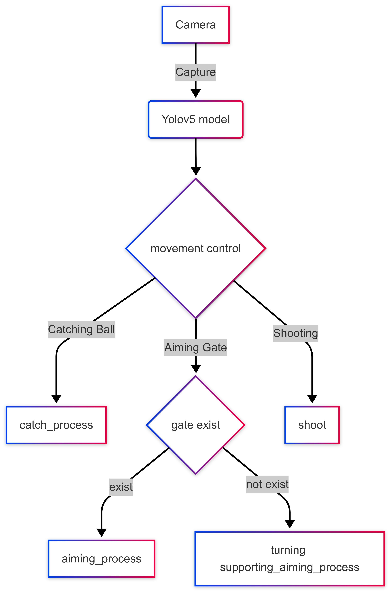
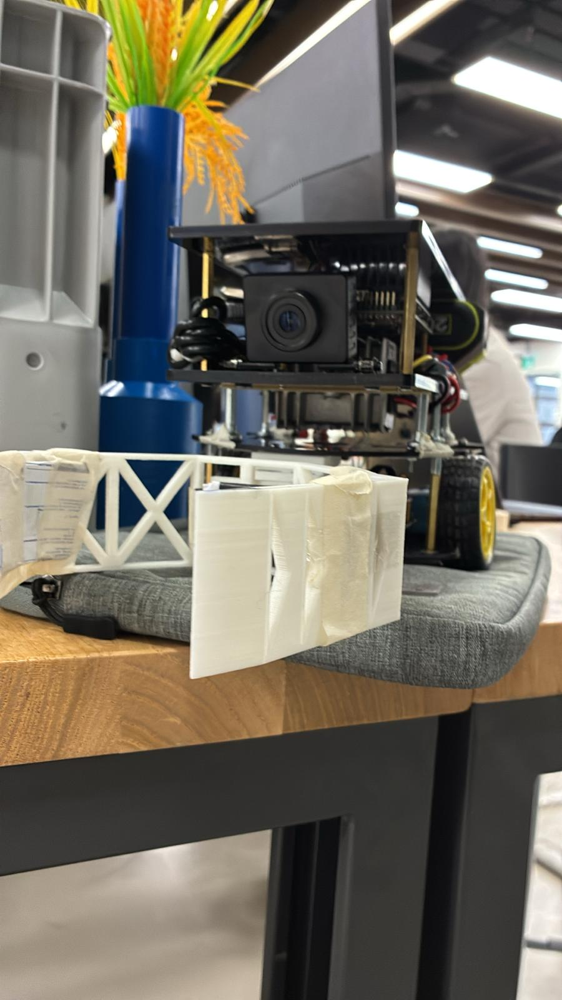

# Obj_Detection_Car

This is a project using a Yolov5 object detection model to control a robot car with a jetson nano. The target is to push different color balls to the correct gate.

The car will capture a photo from the camera, then using the Yolo model to do object dectection.
Base on the result of the model, the car will activate different process base on its state.
Different process will send a command to drive the motors to go forward or make a turnning.

## Car view 

This car uses a 3d printing catching hook and it is driven by two motors.
